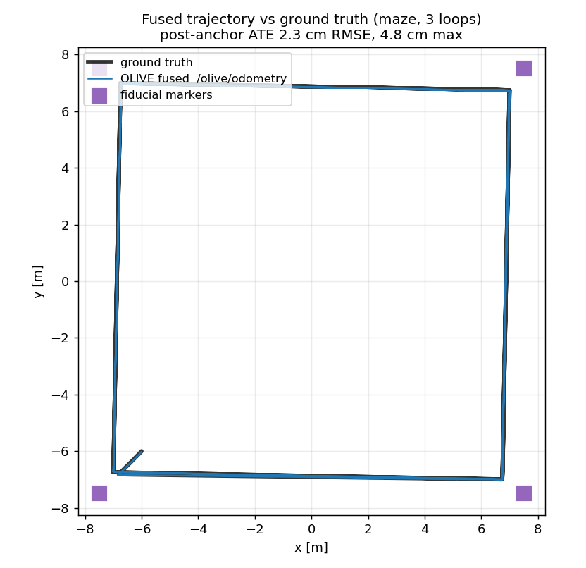
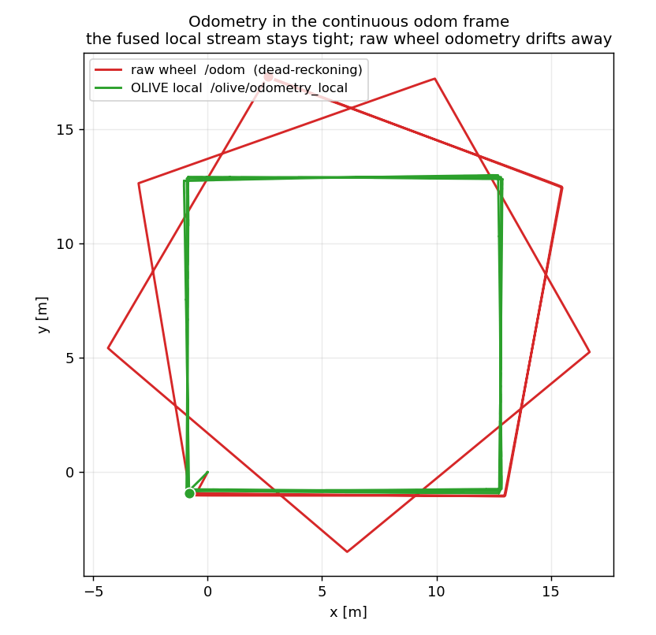
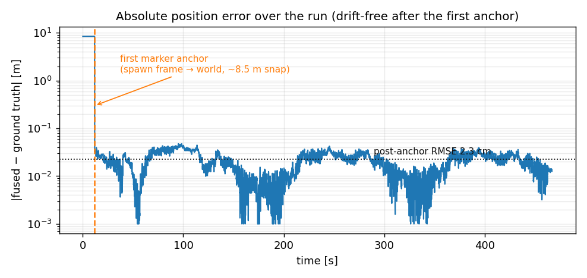
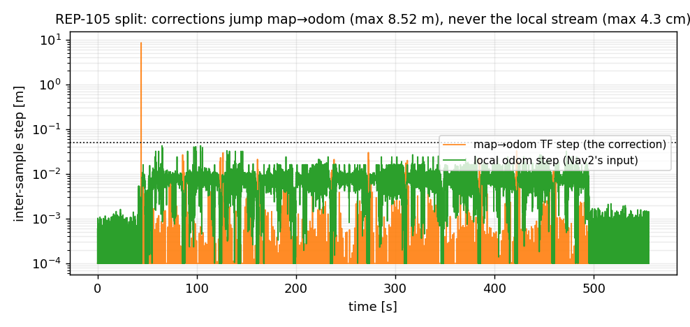
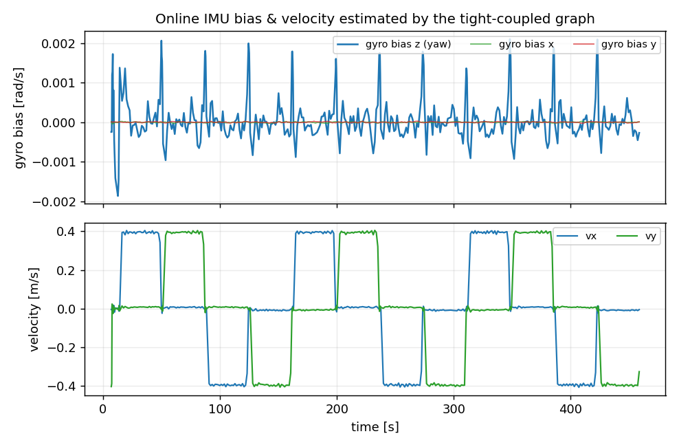
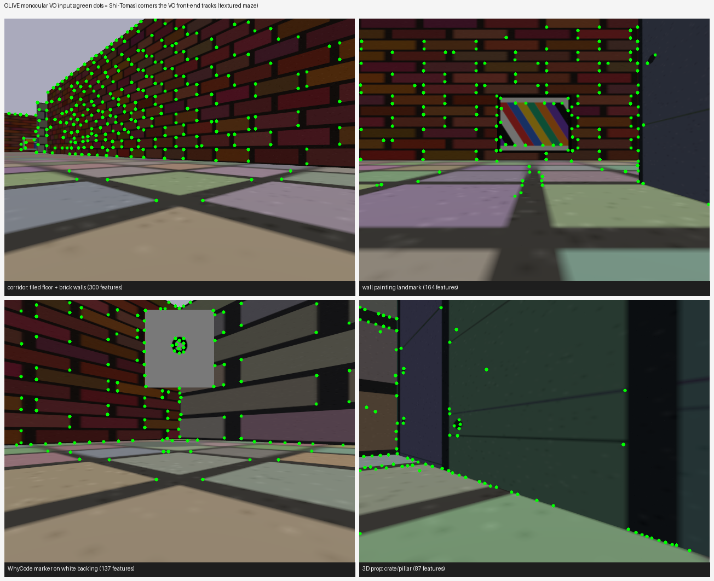
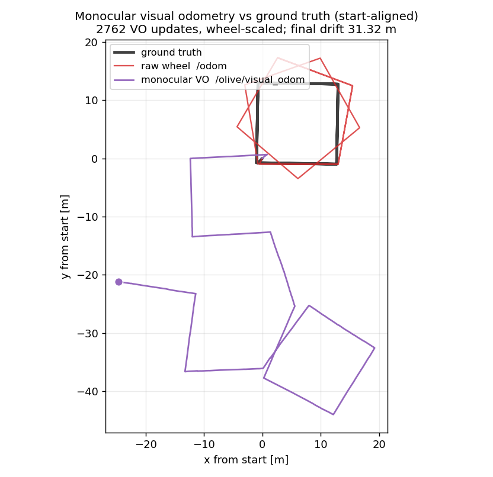

# OLIVE

**O**ptimization of **L**idar, **I**nertial, **V**ision & **E**ncoders — graph-based multi-modal sensor fusion for a planar ground robot. ROS 2 **Jazzy**, C++20, [GTSAM](https://github.com/borglab/gtsam) factor-graph backend.

One iSAM2 keyframe graph fuses LiDAR, IMU (tightly coupled), wheel encoders, WhyCode fiducials and monocular visual odometry, with ICP loop closure. It produces both a globally-accurate map-frame pose and a smooth, jump-free odom-frame stream — a drop-in localization backend for Nav2.

<p align="center">


</p>

*Left: the fused estimate tracks ground truth to ~2 cm over three 56 m loops. Right: in the continuous odom frame, OLIVE's fused local odometry (green) stays a tight, repeatable square while raw wheel dead-reckoning (red) drifts away — the "smoother, more accurate odometry" a controller consumes.*

## Architecture

One incremental (iSAM2) keyframe pose graph fuses every modality; each source is a runtime toggle in `config/fusion.yaml`:

| Modality | Role | Enters the graph as |
|----------|------|---------------------|
| LiDAR + IMU (`lio`) | backbone odometry: curvature features → scan-to-map Gauss-Newton, gyro-seeded | between factor per keyframe |
| IMU (tight coupling) | preintegrated rotation constraint + **online gyro/accel bias estimation** (`imu_preintegration`) | `CombinedImuFactor` chain over `V(i)`/`B(i)` states |
| Wheel odometry (`wheel`) | metric-scale anchor | between factor (tight x/y, loose yaw) |
| WhyCode fiducials (`markers`) | **landmark variables `L(id)`** (TagSLAM-style): surveyed ids anchor the world frame, any other repeatedly-sighted marker acts as an odometry constraint — position-only, orientation never used | robust binary observation factor (+ position prior for surveyed ids) |
| Monocular camera (`vo`) | auxiliary wheel-scaled KLT visual odometry (on in sim) — the weakest modality: correct scale but drifting heading, so it enters with **loose** sigmas and is downweighted | robust between factor |

A soft planar prior pins z / roll / pitch (ground motion). Two odometry outputs implement the REP-105 split end-to-end:

- **`/olive/odometry`** (map frame) — the globally-accurate graph estimate; marker anchors and loop closures jump HERE via the `map→odom` correction.
- **`/olive/odometry_local`** (odom frame, ~50 Hz) — a continuous, jump-free stream built from scan-match increments + wheel + gyro, with the matching `odom→base_footprint` TF (`publish_odom_tf`). This is what a local controller (Nav2) should consume: `map→odom` absorbs every global correction, so the local stream never teleports.

Known markers act like local GPS fixes: the `X(0)` prior is deliberately loose, and the first accepted marker sighting bends the whole trajectory into the surveyed world frame.

The LiDAR-inertial core follows the architecture of [LIO-SAM](https://github.com/TixiaoShan/LIO-SAM), used as a design reference; the implementation here is written for this project (organized 16-ring clouds, eigen-based plane fits with a collinearity gate, planar-motion handling, coarse-azimuth feature windows) and heavily modified around the marker-anchoring backend. Marker detection uses [whycode](https://github.com/Adyansh04/whycode).

## Nodes

- **`fusion_node`** — the core (`rclcpp_lifecycle`, self-managed bring-up): LiDAR pipeline, factor graph, wheel/marker/VO fusion, TF.
- **`vo_node`** — monocular VO front-end: KLT tracking + essential matrix, yaw from in-place rotation, translation scaled by wheel motion (monocular scale is unobservable on a planar robot). Publishes `/olive/visual_odom`.
- **`whycon`** (from `whycode_vision`) — marker detector, launched when `markers` is enabled; sim configs live in `config/whycode_detector_sim.yaml`.

Source layout (mirrored in `include/olive/`):

```
src/
  nodes/              executable mains
  fusion/             FusionNode split by concern:
    fusion_node_lifecycle.cpp   parameters, config, lifecycle transitions
    fusion_node_sensors.cpp     IMU/wheel/marker callbacks, IMU init, bias
    fusion_node_lidar.cpp       scan hot path, factor insertion, iSAM2, loops
    fusion_node_publish.cpp     odometry outputs, TF, diagnostics
    fusion_node_debug.cpp       RViz debug visualization
    frontend/         scan preprocessing, feature extraction, scan matching
    graph/            pose graph, keyframe map, loop detection, marker factors
    inputs/           IMU / wheel-odom buffers, marker gate
  vo/                 monocular VO front-end
scripts/              bringup/ · evaluation/ · fault_injection/  (see scripts/README.md)
benchmark/            full-stack replay + micro benchmarks, per-change results log
```

## Build

```zsh
source /opt/ros/jazzy/setup.zsh
cd ~/olive_ws
colcon build --symlink-install --packages-select olive
source install/setup.zsh          # source after every build
```

The default build uses the stock apt GTSAM/PCL and works everywhere. For the
optimized build — source-built GTSAM + PCL 1.15 with AVX2 and the ~2× faster
nanoflann scan-matcher search — see [BUILDING.md](BUILDING.md); per-change
measurements are in [benchmark/RESULTS.md](benchmark/RESULTS.md).

`whycode_vision` (the marker detector) needs the [Simd](https://github.com/ermig1979/Simd)
library — build it to a prefix and pass `-DSIMD_INCLUDE_DIR`/`-DSIMD_LIBRARY` if
it is not in `/usr/local`.

## Run

**Fastest path — one command brings up sim + fusion in the maze and drives a
test loop.** `bringup_test.sh` kills stragglers, launches exactly one sim + one
stack, verifies the process counts, then runs the chosen test:

```zsh
# ros2 run olive bringup_test.sh [world] [test] [rviz]
#   world: maze | fusion_test | warehouse | office | industrial
#   test:  none | drive | drive-long | ate | marker | smooth
ros2 run olive bringup_test.sh maze drive
ros2 run olive bringup_test.sh maze none rviz   # bring up + RViz debug view, no test
```

**Or run the pieces yourself, one per terminal:**

```zsh
# 1. Simulation (Gazebo Harmonic). headless:=true = no GUI; drop it to watch.
ros2 launch olive_sim simulation.launch.py world_name:=maze headless:=true

# 2. Fusion stack — reads config/fusion.yaml, starts only the modalities enabled
#    under `modalities:`, and hands each node its parameter section.
#    rviz:=true opens the debug view; config_file:=<path> overrides fusion.yaml.
ros2 launch olive sensor_fusion.launch.py rviz:=true

# 3. Drive a repeatable closed-loop square (chases corners via /ground_truth)
ros2 run olive square_drive.py --half 7.0 --loops 3 --speed 0.4
```

Fused output appears on `/olive/odometry` (map frame) and `/olive/odometry_local`
(smooth odom frame); debug streams are under `/olive/debug/*` (off by default —
enable in `config/fusion.yaml`).

**Record once, replay offline** — the cheap iteration loop, and what the
benchmarks use. Capture the raw sensor streams with the sim running, then replay
them through the stack with no simulator (faster and deterministic):

```zsh
# record raw inputs while a drive runs (sim + fusion up)
ros2 bag record -o my_run /lidar/points /imu/data /odom /camera/image_raw \
                          /camera/camera_info /tf /tf_static /clock /ground_truth

# later: start the fusion stack, then replay the inputs into it
ros2 bag play my_run --clock

# evaluate any recorded run offline — ATE, smooth-stream continuity, VO health
ros2 run olive analyze_bag.py my_run --max-step 0.05
```

More validation, calibration, and fault-injection tools are documented in
[`scripts/README.md`](scripts/README.md); the fixed CPU benchmark is in
[`benchmark/README.md`](benchmark/README.md).

## Configuration

Everything lives in [config/fusion.yaml](config/fusion.yaml): modality toggles, topics, extrinsics (base←lidar, base←camera), feature/matcher/keyframe tuning, factor noise sigmas (ROS axis order — permuted to GTSAM tangent order internally), the known-marker map, and gating (range window, tracking persistence). Notes that came out of integration testing are recorded as comments next to the parameters they affect, including:

- the detector reports marker positions in the **camera_link body convention** (x forward), not the optical frame;
- decoded sim marker IDs are model index + 1;
- distant markers can mis-decode with `id_valid=true` — the range gate rejects them;
- detected range runs ~5 % long in sim (tune `outer_diameter` in the detector config).

## Real-robot bring-up

`config/fusion_real.yaml` and `config/whycode_detector_real.yaml` are
hardware templates with TODO-marked calibration values. The order that works:

1. **Camera intrinsics** — calibrate, save next to the detector config and
   point `camera.config_path` at it (distortion is supported).
2. **Extrinsics** — prefer `extrinsics_from_tf: true` with your URDF; note
   `camera_frame` must be the frame the detector reports in (real whycode:
   the optical convention, unlike sim).
3. **IMU units/axes sanity** — launch and read the `IMU init` log lines: they
   check |accel| vs 9.8 (g vs m/s²), bias magnitude (deg/s vs rad/s) and
   gravity tilt (mounting rotation). Keep the robot stationary for the
   `imu_init_duration_s` window after launch.
4. **Time offsets** — read the per-sensor `stamp-to-arrival latency` startup
   log lines; compensate via `*_time_offset_s` (LiDAR is the reference).
5. **Detector range scale** — `ros2 run olive calibrate_marker_range.py`
   against a marker at a surveyed position; set `outer_diameter_multiplier`.
6. Survey marker world positions (z is in the MAP frame — origin at
   base_link start height, not the floor) into `known_marker_positions`.

7. **odom→base TF ownership** — `publish_odom_tf: false` keeps your base
   driver's TF (this node only broadcasts `map→odom`). To let Nav2 consume
   the fused local odometry, disable the driver's TF and flip the flag:
   exactly ONE node may publish `odom→base`.
8. **IMU tight coupling** — after the basics work, calibrate the IMU noise
   sigmas (datasheet or Allan variance) and set `imu_preintegration: true`;
   verify by plotting `/olive/debug/bias` (the online estimate should sit
   near the stationary-init value and track slow drift).

Real LiDAR notes: unorganized (`height==1`) clouds need a `ring` field;
per-point time fields (`time`/`t`/`timestamp`) enable gyro deskew.
LiDAR dropouts are coasted on wheel odometry with `/diagnostics` reporting;
loop closure corrects drift on revisits when markers are out of view.

### Nav2 wiring (drop-in AMCL replacement)

This node fills the AMCL slot: it owns `map→odom` (and, with
`publish_odom_tf`, the smooth `odom→base_footprint`). Point the Nav2
controller's `odom_topic` at **`/olive/odometry_local`** and keep the
global/local costmap frames at `map`/`odom` as usual; drop AMCL from the
bringup. Localize before you navigate: until the first surveyed marker is
sighted the map frame is spawn-relative (the first anchor is a one-time
multi-metre `map→odom` jump).

## Tests

```zsh
colcon test --packages-select olive && colcon test-result
```

65 unit tests across 12 suites: covariance conventions, scan preprocessing and
matching on synthetic geometry, keyframe map + cloud budget, marker
anchor/observation factors (analytic vs numerical Jacobians, drift recovery),
buffers, health monitoring, and loop detection.

## Results

Gazebo Harmonic, maze world (16×16 m), 3 loops of a 56 m square. The maze is
textured (tiled floor, brick/panel/block walls), dressed with wall paintings and
3-D props, and its markers sit on white backing panels — feature-rich enough for
the monocular VO front-end. Figures are generated from a recorded bag by
[`scripts/evaluation/plot_results.py`](scripts/evaluation/plot_results.py).

| Metric | Value |
|--------|-------|
| Absolute trajectory error (post-anchor, vs ground truth) | **2.0 cm RMSE**, 4.6 cm max |
| Fused ATE, VO on vs off (steady-state) | **~2 cm vs 3.6 cm** — VO on is not worse (tight-sigma VO: 29 m) |
| Drive-test relative accuracy (35 s multi-turn) | **0.8 cm / 0.04°** |
| First-anchor drift reset (spawn frame → world) | 8.5 m → few cm, one sighting |
| Local-stream max step, 3 loops (all corrections in `map→odom`) | **2.4 cm** |
| Monocular VO scale accuracy (path length vs ground truth) | **0.98** (heading drifts uncorrected — fused loose) |
| Unsurveyed-marker landmark convergence | **6–8 cm** from sightings alone |
| LiDAR-core throughput | 10 Hz, 6–12 ms/scan |

### Accuracy over the run — drift-free after the first anchor



The map frame starts spawn-relative (~8.5 m offset); the first fiducial sighting
snaps the whole trajectory into the surveyed world frame, after which error stays
bounded — dipping to millimetres at each corner marker and never accumulating
across the three loops. That multi-metre snap lands entirely in `map→odom`, never
in the smooth local stream a controller consumes.

### The REP-105 split — smooth local odometry for Nav2



OLIVE publishes two odometry outputs: `/olive/odometry` (map frame,
globally accurate, **allowed** to jump) and `/olive/odometry_local` (odom
frame, ~50 Hz, **continuous**). Every global correction — the 8.5 m anchor
snap, every loop closure — lands in the `map→odom` transform; the local stream
a controller consumes never steps more than a few cm. That is what makes it a
drop-in AMCL replacement for Nav2.

### Tight IMU coupling — online bias & velocity



Velocity and gyro/accel bias are states in the graph, chained by preintegrated
`CombinedImuFactor`s. The estimated velocity tracks the square drive; the gyro
bias stays bounded near zero (the sim IMU has negligible true bias). In a
fault-injection test, a 0.02 rad/s bias stepped on mid-run — invisible to the
stationary startup estimate — is recovered online to **0.0197 rad/s within
~25 s**, something a loosely-coupled filter cannot do.

### Monocular visual odometry — the weakest modality, safely fused

<p align="center">

</p>

The `vo` modality runs a standard monocular pipeline (Shi-Tomasi + KLT → essential
matrix → `recoverPose`, keyframe-parallax gating, translation scaled by wheel
odometry). For it to have anything to track, the maze carries **image textures,
wall paintings and 3-D props** — the frames above show the hundreds of corners it
locks onto per frame; the WhyCode markers sit on **white backing panels** so the
detector still segments them against the busy walls.



VO measures the right *distances* — its path length is **98 %** of ground truth —
but, like any uncorrected monocular VO, it **drifts in heading** (the pinwheeling
squares), worst at the in-place corner turns where pure rotation makes the
essential matrix ill-conditioned. That is exactly why it enters the graph as a
**loose, robust** between factor. An A/B on the same route: with *tight* sigmas
VO's drift fights the marker anchor and blows the world-frame estimate to **29 m**;
with loose sigmas the steady-state ATE is **~2 cm with VO on vs 3.6 cm with VO
off** — i.e. VO on is *not worse* than VO off. VO earns its keep as redundant
motion during a LiDAR dropout, not as a primary constraint. (Reducing the raw drift — camera pitch, a homography fallback for
in-place turns — is a possible future improvement; the fusion does not need it.)

### Robustness (fault injection)

- **Marker odometry / LiDAR blackout**: during a 25 s LiDAR outage, marker
  observations pull the coasted trajectory back to **1.1 cm** final error;
  with markers off the same outage drifts 4.9 m and never recovers.
- **Corrupted wheel odometry** (`scripts/fault_injection/wheel_odom_relay.py`, ~13 m injected
  drift): the fused output is unchanged — LiDAR + markers carry the estimate.
- **Loop closure** (crippled matcher, no wheel factors): an out-and-back route
  improves from 4.44 m to **0.39 m** final error (11×).
- **Endurance**: a 10-minute continuous drive with bounded cloud storage ends
  1–2 cm from ground truth, with per-sensor `/diagnostics` health throughout.

Reproduce: record with [`scripts/bringup/square_drive.py`](scripts/bringup/square_drive.py) +
`ros2 bag record`, analyse offline with
[`scripts/evaluation/analyze_bag.py`](scripts/evaluation/analyze_bag.py), and regenerate these
figures with `scripts/evaluation/plot_results.py`. For CPU numbers, use the
fixed replay benchmark in [`benchmark/`](benchmark/README.md).
